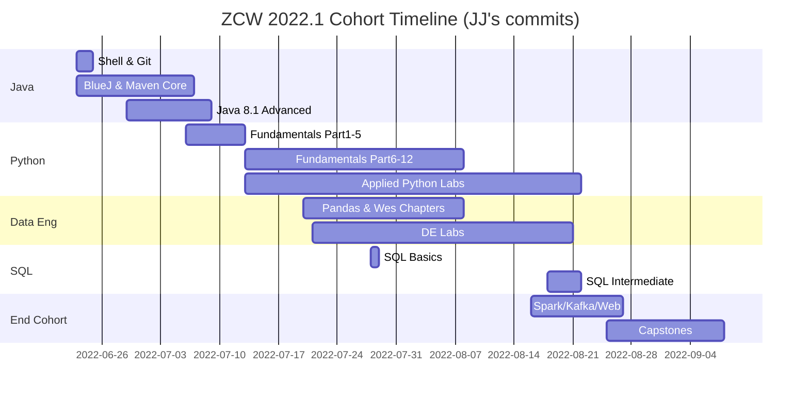

# Curriculum Progression

Recommended learning order across all ZCW D3.1 subjects, derived from GitHub commit timelines.

## Overview



## Track Sequence

| Order | Track | Weeks | Doc |
|------:|-------|------:|-----|
| 1 | Java / BlueJ / Maven | 1–4 | [java-track.md](../zipcode-repos/java-track.md) |
| 2 | Python Fundamentals | 3–6 | [python-fundamentals.md](../zipcode-repos/python-fundamentals.md) |
| 3 | Data Engineering | 5–8 | [data-engineering.md](../zipcode-repos/data-engineering.md) |
| 4 | SQL | 6–8 | [sql-track.md](../zipcode-repos/sql-track.md) |
| 5 | Spark / Kafka / Web | 8–9 | [spark-kafka-web.md](../zipcode-repos/spark-kafka-web.md) |

Tracks 2–4 overlap in real time (July–August 2022). The order above reflects dependency chains, not strict calendar separation.

## Parallel Tracks Diagram

```
Week 1-2          Week 3-4          Week 5-6          Week 7-8          Week 9+
────────          ────────          ────────          ────────          ──────
Shell/Git    ──►  Maven Labs   ──►  Java 8.1     ──►  (unstarted    ──►
BlueJ             Quiz              Maven labs)                         Capstones
                  Team Calc 🚫                                          Spark/Kafka
                                                                        CSS/JS

                  Python Pt 1-5  ──►  Python Pt 6-12 ──►  DE Labs    ──►  SQL Labs
                                      Applied Labs         Pandas         Databases 🚫
```

## Refresher Strategy

When re-doing the curriculum:

1. Start from `refresher` branch (clean upstream fork state)
2. Follow track progression in order
3. Prioritize [unstarted forks](../zipcode-repos/unstarted-forks.md) — these were assigned but never completed
4. Compare your work against `as-is` branch when done (your 2022 solutions)
5. Use `stock` branch to see exactly what the repo looked like before you touched it

## Prerequisites Matrix

| Lab | Requires |
|-----|----------|
| Maven.TooLargeTooSmall | Shell.Console-Lab |
| BlueJ labs | Maven.TooLargeTooSmall |
| EightOneQuiz1 | Maven core labs |
| Python Part N | Python Part N-1 |
| Pandas1-2dot1 | Python Part 8+ |
| DE Labs | Pandas1-2dot1 |
| SQL labs | Python Part 6 (dicts/lists) |
| Kafka3-Data | Python Part 10+ |
| PySpark-JupyterTest | DE Labs.Libraries |
